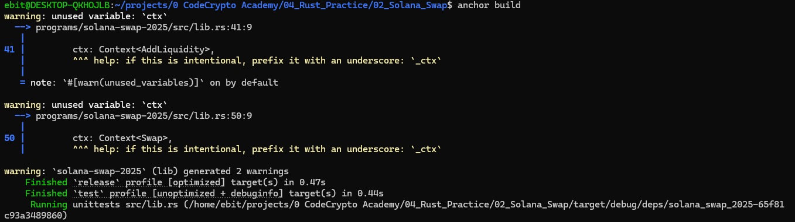

# Solana Token Swap - Académico (2025)

Este es un proyecto educativo de aprendizaje de Rust y Solana utilizando el framework **Anchor**. Consiste en un intercambiador descentralizado descentralizado (Token Swap) que permite registrar un mercado de intercambio de tokens, administrar tasas de cambio por una autoridad, proveer liquidez y ejecutar intercambios atómicos (Swaps).

El proyecto está diseñado como una guía paso a paso para que cualquier estudiante pueda clonar el repositorio y practicar el desarrollo en Solana.

---

## 🛠️ Requisitos de Entorno

Antes de comenzar, asegúrate de tener instalado lo siguiente en tu sistema (preferiblemente un entorno Linux o WSL en Windows):

1. **Rust y Cargo**: El lenguaje de programación y administrador de paquetes de Rust.
2. **Solana CLI o Agave CLI**: Herramientas de interfaz de línea de comandos de Solana.
3. **Node.js** (versión v18 o superior) y **NPM**.
4. **Anchor CLI**: El framework para escribir programas seguros en Solana.

### ⚙️ Configuración Importante del PATH (Línea de Comandos)
Si al ejecutar comandos de Anchor el sistema intenta descargar herramientas o no reconoce comandos como `solana` o `cargo-build-sbf`, asegúrate de añadir las siguientes rutas al final de tu archivo `~/.bashrc`:

```bash
export PATH="$HOME/.local/share/solana/install/active_release/bin:$HOME/.local/bin:$HOME/.cargo/bin:$PATH"
```

Luego, aplica los cambios ejecutando:
```bash
source ~/.bashrc
```

---

## 🚀 Instalación y Preparación

1. **Clonar el repositorio**:
   ```bash
   git clone <url-del-repositorio>
   cd solana-swap-2025
   ```

2. **Instalar las dependencias de Node.js**:
   Instala las bibliotecas necesarias para las pruebas locales (incluyendo `@solana/spl-token` y `@anchor-lang/core`):
   ```bash
   npm install
   ```

---

## 🏗️ Estructura del Programa (Rust)

El programa se ubica en `programs/solana-swap-2025/src/lib.rs`. Actualmente tiene definidos los siguientes elementos clave:

### 1. Estado del Mercado (`MarketAccount`)
Utilizamos la macro `#[derive(InitSpace)]` para que Anchor calcule automáticamente el espacio de almacenamiento del mercado en la cuenta PDA (107 bytes):
* `authority`: Dirección pública del administrador del mercado.
* `token_mint_a`: Dirección del mint de la criptomoneda/Token A.
* `token_mint_b`: Dirección del mint de la criptomoneda/Token B.
* `price`: Precio de intercambio (escalado).
* `decimals_a` y `decimals_b`: Decimales de ambos tokens.
* `bump`: Semilla única para firmar transacciones desde la PDA del mercado.

### 2. Instrucciones Implementadas
* **`initialize_market`**: Registra un nuevo mercado, crea los Vaults (bóvedas de custodia de tokens) para el Token A y Token B, y define la configuración inicial (precio, decimales y bump).
* **`set_exchange_rate`**: Permite a la autoridad del mercado cambiar el precio de cotización de los tokens de forma segura.
* **`add_liquidity`**: Esqueleto para depósito de fondos en el vault por parte de proveedores de liquidez.
* **`swap`**: Esqueleto para la ejecución matemática y física del intercambio atómico de tokens.

---

## 💻 Comandos Principales

### 🔨 Compilar el Programa (`anchor build`)
Compila el contrato inteligente en Rust, genera el IDL en JSON y actualiza automáticamente los tipos TypeScript de las pruebas.

```bash
anchor build
```

*Puedes ver un ejemplo visual de la compilación exitosa en:*


### 🧪 Ejecutar Pruebas Automatizadas (`anchor test`)
Levanta un validador local de Solana temporalmente, despliega el programa compilado y ejecuta la suite de pruebas unitarias (`tests/solana-swap-2025.ts`).

```bash
anchor test
```

*Las pruebas validan:*
1. La creación dinámica de los tokens A y B de prueba.
2. La inicialización correcta del mercado PDA y sus vaults asociados (`vault_a` y `vault_b`).
3. El cambio de la tasa de cambio con la firma autorizada del administrador.

*Puedes ver el resultado de las pruebas exitosas en:*


---

## 📁 Estructura del Proyecto

```text
├── Anchor.toml           # Configuración del entorno de Anchor
├── Cargo.toml            # Dependencias del espacio de trabajo
├── package.json          # Script de prueba y dependencias TypeScript
├── programs/
│   └── solana-swap-2025/
│       ├── Cargo.toml    # Dependencias de Rust (anchor-spl)
│       └── src/
│           └── lib.rs    # Código fuente principal en Rust
├── tests/
│   └── solana-swap-2025.ts # Suite de pruebas en TypeScript
└── images/               # Capturas de pantalla e imágenes de soporte
```

---

*¡Buena suerte con tu práctica de Rust y Solana! Si tienes dudas o detectas algún bug, abre un Issue o consúltalo con tu profesor.*
